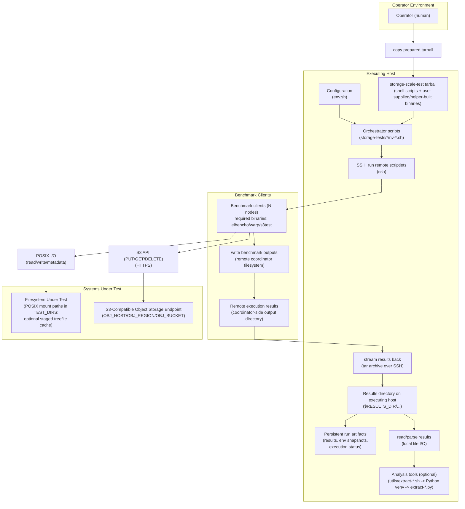
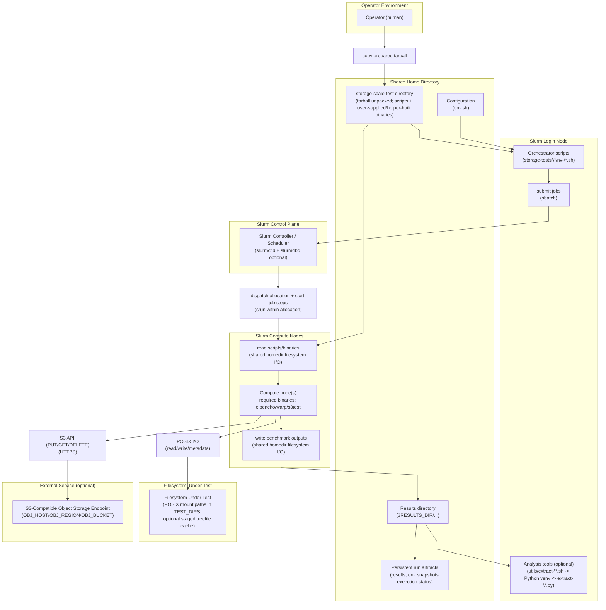

<!--
SPDX-FileCopyrightText: Copyright (c) 2026 NVIDIA CORPORATION & AFFILIATES. All rights reserved.
SPDX-License-Identifier: Apache-2.0

Licensed under the Apache License, Version 2.0 (the "License");
you may not use this file except in compliance with the License.
You may obtain a copy of the License at

http://www.apache.org/licenses/LICENSE-2.0

Unless required by applicable law or agreed to in writing, software
distributed under the License is distributed on an "AS IS" BASIS,
WITHOUT WARRANTIES OR CONDITIONS OF ANY KIND, either express or implied.
See the License for the specific language governing permissions and
limitations under the License.
-->

# NVIDIA Storage Scale Test — Architecture

## Product Architectural Specification

NVIDIA Storage Scale Test is a benchmark orchestration tool packaged by the user as a single tarball for transfer into a test environment. This repository does not distribute pre-built benchmark binaries; users are responsible for obtaining, building, validating, and complying with license/security requirements for the binaries they include. The architecture has four components:

1. **Orchestration layer.** Shell scripts on an executing host (login node or workstation) drive benchmark execution. A single configuration file (`env.sh`) parameterizes all behavior. The orchestration layer supports two mutually exclusive dispatch mechanisms:
   - **Slurm:** Jobs are submitted via `sbatch` to a Slurm controller, which allocates compute nodes and executes benchmark workloads within job allocations.
   - **SSH:** Benchmark code is transmitted as self-contained scriptlets to remote nodes over passwordless SSH. Results are streamed back through SSH, normally as tar archives.

2. **Benchmark clients.** One or more nodes run required benchmark and connectivity binaries (for example elbencho, Warp, and s3test) that were supplied by the user or produced by helper build scripts before the tarball was taken into the test environment. These nodes issue IO against the systems under test and write result files to local or shared storage.

3. **Systems under test.** The targets of benchmark IO:
   - POSIX filesystems mounted on the benchmark clients.
   - S3-compatible object storage endpoints accessed over HTTPS.
   - Network paths between benchmark clients (TCP throughput/latency).

4. **Analysis tools.** Python scripts (invoked through shell wrappers that auto-manage a virtualenv) parse result files and produce terminal tables, PNG plots, and optional Markdown reports.

The tool has no always-running daemon or server-side control plane. It does
intentionally persist run artifacts under `RESULTS_DIR`, including result data,
configuration snapshots, and reified filesystem-sweep executions with their
status sentinels. Optional treefile caches are stored alongside staged datasets.
Together these artifacts support report regeneration, dataset reuse, and
`nv-elbencho-sweep.sh --resume` after an interrupted run.

No component requires an inbound connection from outside the cluster or other
operator-controlled benchmark environment. Within that boundary, benchmark
clients receive SSH connections from the executing host, and elbencho/Warp
benchmark services open temporary listeners for their coordinators and peer
clients.
Outbound connections to configured services such as an S3-compatible endpoint
may cross the cluster boundary. Infrastructure administrators can enforce this
model with network access policies and firewalls that deny outside-initiated
connections while permitting the required internal benchmark traffic and
explicitly configured outbound traffic.

The diagrams below illustrate the two execution modes.

---

## SSH Mode (Passwordless SSH Cluster)

## Slurm Mode (Login Node + Slurm Controller + Compute Nodes)

